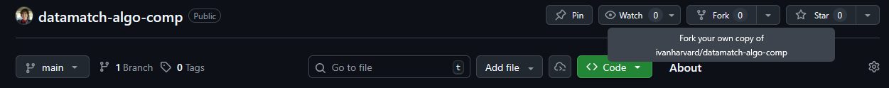
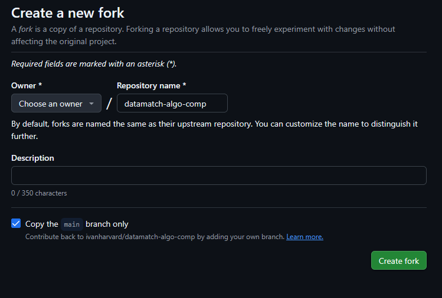

# Forking this repository

On the Github website, click this button:


You should see a screen like this:


Then, select "Choose an owner" and select your username.

Afterwards, click "Create fork."

You are now free to work on this fork. Be sure to sync with my repository when
a new assignment drops.

# Requirements

You'll probably want to install [`VSCode`](https://code.visualstudio.com/) if
you haven't already.

You'll probably want to install [`Github Desktop`](https://desktop.github.com/download/)
(or just use `Git` if more comfortable).

In the terminal of your chosen IDE, run
```
pip install check50
python3 -m pip install --upgrade "git+https://github.com/cs50/check50@4.0.0-dev"
```
This installs `check50`, and is how you'll check your work.

# Completing an assignment

When a new assignment is released, sync with my repository. You should see a new
folder being added to your repository upon syncing. This is the new assignment
and is labeled something like `comp1` or `comp2` or `comp3`. Let's focus on
`comp1` for now.

Inside `comp1`, you should be able to see some files you were provided with. One
of those files is the `README.md` with instructions on how to complete the
assignment and instructions on how to check your work.

You aren't required to pass all the tests. This work is entirely completion 
based, but you're still encouraged to run `check50` on your work. 

You can see how we're testing you in two ways:
1. Read `__init__.py`. This is the `check50` file we use to check your work.
2. Read any file inside the `tests/` folder. This is what `check50` will run to
compare your outputs against a known set of answers.